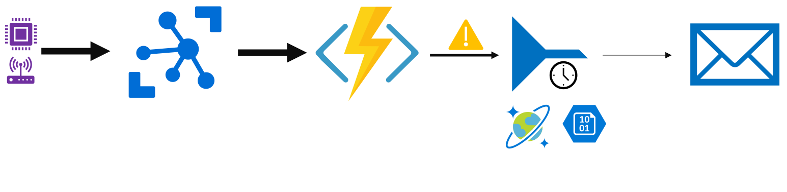

# Using distributed locking in Azure Functions



This sample Azure Function app demonstrates a way to use Azure Storage or CosmosDB to throttle specific blocks of the function execution.

## Sample scenario

IoT devices send telemetry data to Azure IoT Hub containing measured temperature. Based on measured temperature thresholds a notification should be sent. Notifications per device cannot be triggered more than once every 60 seconds.

## Solution demonstrated here

As to most software engineering problems there are multiple solutions to a problem. The one implemented in this repository uses Azure Functions to process telemetry data coming from IoT Hub, sending a notification if a device temperature gets too high.

The challenge is to ensure that a single device will not trigger the alert more than once every 60 seconds. The approach demonstrated here uses distributed locking backed by Azure Storage or Cosmos DB.

## Locking using Azure Storage

Azure storage locking implementation relies in leasing blob files for a certain amount of time. Once a blob is leased, no one else can lease it until it the expiration time is reached. Leasing in Azure storage must stay between the range of [15 to 60 seconds](https://docs.microsoft.com/en-us/rest/api/storageservices/lease-blob).

The implementation is the following:

```c#
/// <summary>
/// Tries to acquire a lease
/// </summary>
/// <param name="id"></param>
/// <param name="throttleTime"></param>
/// <param name="leaseId"></param>
/// <returns></returns>
protected internal override async Task<bool> TryAcquireLeaseAsync(string id, TimeSpan throttleTime, string leaseId)
{
    // TODO: make this smarter, call only if the container does not exists
    await this.containerReference.CreateIfNotExistsAsync();


    // create blob if not exists
    var blob = this.containerReference.GetAppendBlobReference(id);
    try
    {
        await blob.CreateOrReplaceAsync(
            AccessCondition.GenerateIfNotExistsCondition(),
            null,
            null);
    }
    catch (StorageException ex) when (ex.RequestInformation?.HttpStatusCode == (int)HttpStatusCode.Conflict || ex.RequestInformation?.HttpStatusCode == (int)HttpStatusCode.PreconditionFailed)
    {
        // ignore exception caused by conflict as it means the file already exists
    }


    try
    {
        // try to acquire lease
        await blob.AcquireLeaseAsync(
            throttleTime,
            leaseId,
            new AccessCondition { LeaseId = null },
            null,
            null
            );

        // we leased the file!
        return true;
    }
    catch (StorageException ex) when (ex.RequestInformation?.HttpStatusCode == (int)HttpStatusCode.Conflict || ex.RequestInformation?.HttpStatusCode == (int)HttpStatusCode.PreconditionFailed)
    {
        // if a conflict is returned it means that the blob has already been leased
        // in that case the operation failed (someone else has the lease)
        return false;
    }
}
```

## Locking with CosmosDB

Locking with CosmosDB relies in having a document structure that identifies until when a document is leased.

```json
{
    "id": "deviceID",
    "leaseID": "<instance-id-that-acquired-the-lease>",
    "leasedUntil": "<time-when-lease-will-expire>"
}
```

Updating the lease relies on the document etag to ensure that a single updater will succeed. Unlike the Azure Storage implementation, CosmosDB does not have any limits regarding the locking time.

The code looks like this:

```c#
/// <summary>
/// Tries to acquire a lease
/// </summary>
/// <param name="id"></param>
/// <param name="throttleTime"></param>
/// <param name="leaseId"></param>
/// <returns></returns>
protected internal override async Task<bool> TryAcquireLeaseAsync(string id, TimeSpan throttleTime, string leaseId)
{
    var partitionKey = new PartitionKey(id);

    // Document is already there, check if it has an expired lease
    ItemResponse<CosmosDBLease> readResponse;
    try
    {
        readResponse = await this.container.ReadItemAsync<CosmosDBLease>(id, partitionKey);
    }
    catch (CosmosException ex) when (ex.StatusCode == HttpStatusCode.NotFound)
    {
        // Does not exist: create it!
        return await TryCreateLeaseAsync(id, leaseId, throttleTime);
    }

    var existingLease = readResponse.Resource;
    if (existingLease.LeasedUntil != null && existingLease.LeasedUntil.Value >= DateTime.UtcNow)
        return false;

    var updatedLease = new CosmosDBLease()
    {
        ID = id,
        LeaseID = leaseId,
        LeasedUntil = DateTime.UtcNow.Add(throttleTime),
    };

    try
    {
        var updateLeaseResponse = await this.container.ReplaceItemAsync<CosmosDBLease>(
            updatedLease,
            id,
            partitionKey,
            new ItemRequestOptions()
            {
                IfMatchEtag = readResponse.ETag,
            });

        return updateLeaseResponse.StatusCode == HttpStatusCode.OK;
    }
    catch (CosmosException ex) when (ex.StatusCode == HttpStatusCode.Conflict)
    {
        // someone else leased before us
        return false;
    }
}
```

The sample project contains an IoT Hub and Http Trigger implementation that uses `ThrottledGate` to limit the amount of notifications per device generated. Moreover, it has a InMemoryThrottleGate simple implementation that caches leases in memory with the goal of reducing calls to the backend implementation (Storage or CosmosDB). The optimisation usefulness depends on the scenario and how often a device triggers an alert (before adopting measure in your use case).

Creating a storage based throttled gate:

```c#
static readonly Lazy<ThrottledGate> storageThrottledGate = new Lazy<ThrottledGate>(() =>
{
    return new AzureStorageThrottledGate(Environment.GetEnvironmentVariable("AzureWebJobsStorage"), "device-alerts");
});
```

Using it:

```c#
[FunctionName(nameof(IoTHubDeviceTelemetryListener))]
public static async Task IoTHubDeviceTelemetryListener(
    [IoTHubTrigger("messages/events", Connection = "iothub_connectionstring")] EventData[] events,
    ExecutionContext executionContext,
    ILogger log)
{
    var notificationTasks = new List<Task>();
    foreach (var eventData in events)
    {
        var deviceId = eventData.SystemProperties["iothub-connection-device-id"].ToString();
        var message = JsonConvert.DeserializeObject<DeviceTelemetry>(Encoding.UTF8.GetString(eventData.Body));
        if (message.Temperature >= TemperatureThreshold)
        {
            // notify that the device temperature is too high
            var notificationTask = cachedWithStorageBackendThrottledGate.Value.RunAsync(
                deviceId,
                TimeSpan.FromMinutes(1),
                executionContext,
                async () =>
                {
                    await SendNotificationAsync(deviceId, $"Temperature too high: {message.Temperature}");
                });

            notificationTasks.Add(notificationTask);
        }
    }

    // if there are any notifications, wait for them to finish
    if (notificationTasks.Count > 0)
        await Task.WhenAll(notificationTasks);
}
```

## Extending throttle gates with different backend services

Adding new providers is simple and can be implemented according with backend service you are familiar with (SQL databases, Redis, etc). Take a look at the [ThrottledGate abstract class](https://github.com/fbeltrao/azfunctions-distributed-locking/blob/master/DeviceAlertFunctionApp/ThrottledGate.cs) to understand the implementation requirements.